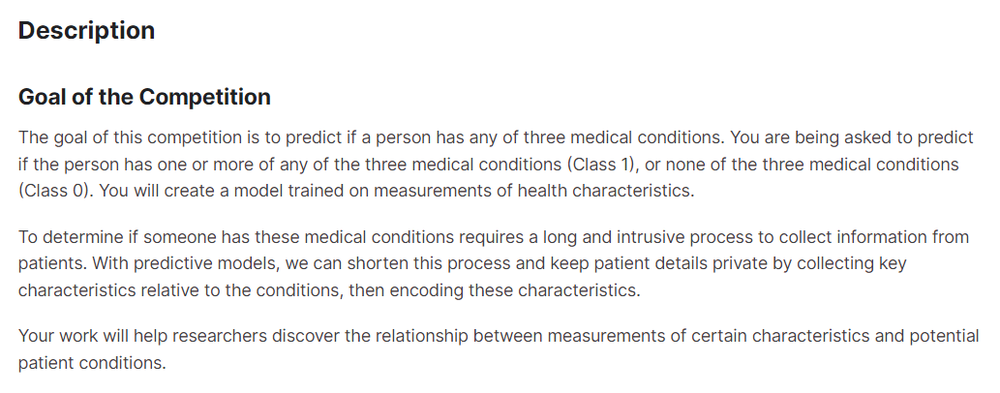
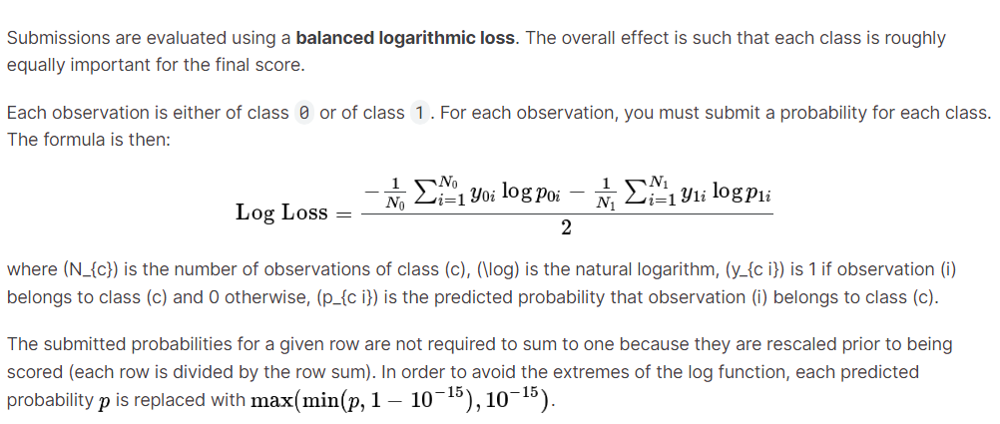
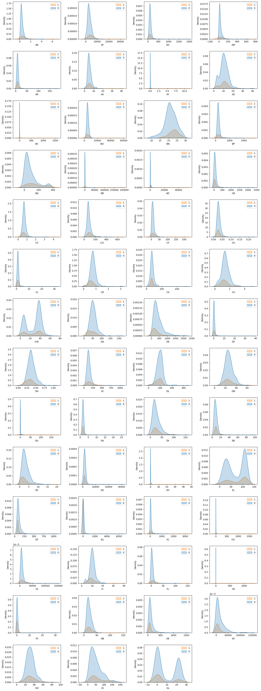
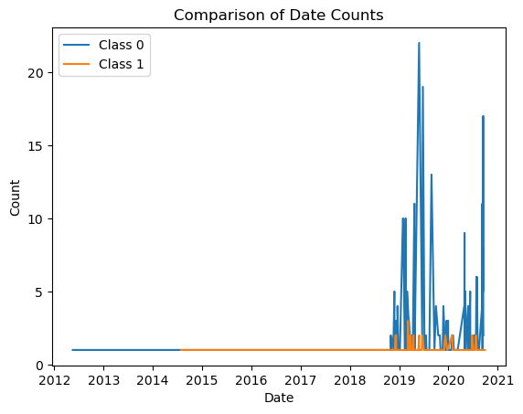

# ICR – Identifying Age – Related Conditions                <!-- 제목 -->

참여자 : 박사무엘, 배태양, 조인철, 박수영, 김민주       <!-- 참여자 -->

---

**대회 기간:** 2023.5 ~ 2022.8 (3 months)         <!-- 기간, 도구, 스택 --> 

**사용 도구:** Discord  
**사용 언어:** Python Pandas Numpy Matplotlib

---

<br>

## ****대회 개요**** <!-- 개요 와 내가 구현것들을 정리 --> 



- 사람들의 의학정보를 가지고 3 가지 질병중 하나라도 해당이 되는지 예측하는 대회.

<br>

## Dataset

- Train.csv - the train set
    + Id : Unique identifier for each observation
    + AB - GL : 56 anonymized health characteristics. All are numeric except for EJ, which is categorical
    + Class (a binary target) : 1 indicates the subject has been diagnosed with one of the three conditions, 0 indicates they have not.

- Test.csv - the test set
    + Your goal is to predict the probability that a subject in this set belongs to each of the two classes

- Greeks.csv - meta data
    + Alpha : Idntifies the type of age-related condition, if present.
        * A : No age - related condition. Corresponds to class 0
        * B, D, G : The three age-related conditions. Correspond to class 1
    + Beta, Gamma, Delta : Three experimental characteristics.
    + Epsilon : The date the data for this subject was collected. Note that all of the data in the test set was collected after the trainning set was collected.

데이터 셋으로는 위와 같은 데이터를 기반으로 대회를 진행했습니다.

<br>

## Evaulation



- 대회에서는 위와 같이 지정한 evaluation method를 사용.
- Evaluation을 통해 발병이 아닐 확률과 발병할 확률로 나뉘어 계산.


<br><br/>

## 대회 진행 과정      <!-- 프로젝트의 진행과정 --> 

1. EDA
2. Data Preprocessing
3. train
4. prediction

<br/>

## 대회 구현 내용  <!-- 프로젝트내에서 의 나의 활동 내용에 대해서는 간단하게 개론의 정도로 --> 

### library

```python
import numpy as np
import pandas as pd
import matplotlib.pyplot as plt
import seaborn as sns

import scipy.stats as stats
from scipy.cluster.hierarchy import linkage, dendrogram, fcluster
from scipy.spatial.distance import squareform


import pickle
import os
import random
from tqdm.auto import tqdm

# ignore warning
import warnings
warnings.filterwarnings("ignore")


# ML
from sklearn.ensemble import RandomForestClassifier  # Bagging
from xgboost.sklearn import XGBClassifier            # GBM
from lightgbm.sklearn import LGBMClassifier          # lightGBM
from sklearn.metrics import accuracy_score


# Feature Selection
from sklearn.feature_selection import SelectKBest, f_classif

# DL
import tensorflow as tf
from tabpfn import TabPFNClassifier #Tabpfn


# for checking multi-collinearity
from statsmodels.stats.outliers_influence import variance_inflation_factor

# KFold(CV), partial : for optuna
from sklearn.model_selection import KFold, StratifiedKFold
from sklearn.preprocessing import LabelEncoder
from sklearn.impute import KNNImputer
from functools import partial
from imblearn.over_sampling import SMOTE
from sklearn.preprocessing import StandardScaler
from sklearn.ensemble import VotingClassifier


# AutoML framework
import optuna
from optuna.samplers import TPESampler
```

<br><br>

### EDA


클래스에 많은 불균형이 존재함

<br>


데이터에는 많은 치우침과 이상치가 보임

<br>



<br>
메타 데이터를 이용한 추가 적인 정보를 취합도 해봄  
발병이 된 경우의 날짜 들이 있나 확인
<br><br>

### Data Preprocessing

Feature selection -> LabelEncoding -> KNN Imputation -> (optional)calculate VIF -> (optional)apply PCA -> feature Scaling 로 진행

<br>

먼저, feature selection을 위해 feature importance를 사용해보기도 해봄, Kaggle discussion을 통해 공유된 Brute Force 로 찾은 EDA feature들만으로 사용해보기도 함, 하이퍼 파라미터를 이용한 auto-selection을 통해 feature들을 솎아내보기도 함.  

이 중에서 우리는 discussion을 통해 찾은 feature들로만 feature selection을 하였음

```python
# feature selection via Feature Importance

if feature_selection:
    rf_param_grid = {'n_estimators': 100, 'max_depth': 10, 'max_features': 0.7}
    rf = RandomForestClassifier(random_state=42, n_jobs=-1)
    rf.fit(X, y)
    print("Train ACC : %.4f" % accuracy_score(y, rf.predict(X)))
    fi_df = pd.DataFrame({'feature':X.columns, 'importance':rf.feature_importances_})
    selected_cols = fi_df.sort_values(by="importance", ascending=False)[:m]["feature"].values
    
    display(selected_cols)
    
    X = train[selected_cols]
    display(X)


## 2) feature selected by EDA. #36개 8x5의 모양 요구 

if feature_selection_2_1:
    features = ['AB', 'AF', 'AH', 'AX', 'AZ', 'BC', 'BN', 'BP', 'BQ', 'CB', 'CC', 'CD', 'CH', 'CL', 'CR', 'DA', 
                'DE', 'DF', 'DH', 'DI', 'DL', 'DN', 'DU', 'DV', 'DY', 'EB', 'EE', 'EG', 'EH', 'EJ', 'EP', 'FD', 
                'FE', 'FI', 'FL', 'FR', 'GE', 'GF', 'GH', 'GL','Id']

    drop_features = [f for f in test.columns if f not in features]
    print(f"Dropped features : {drop_features}")


    #Drop out low informative features for model training 
    X = train.drop(drop_features + ['Class'], axis=1)
    selected_cols = ['AB', 'AF', 'AH', 'AX', 'AZ', 'BC', 'BN', 'BP', 'BQ', 'CB', 'CC', 'CD', 'CH', 'CL', 'CR', 'DA', 
                'DE', 'DF', 'DH', 'DI', 'DL', 'DN', 'DU', 'DV', 'DY', 'EB', 'EE', 'EG', 'EH', 'EJ', 'EP', 'FD', 
                'FE', 'FI', 'FL', 'FR', 'GE', 'GF', 'GH', 'GL']


## 3) feature selection by auto-selection.
# auto-selection.

if feature_selection_3:
    threshold = 0.1
    t_score = 10

    fs = SelectKBest(score_func=f_classif, k=len(X.columns))


    # apply feature selection
    X_selected = fs.fit_transform(X, y.values)
    print('Befoe the SelectKBest = {}'.format(X.shape))

    new_features = [] # The list of features less than the p-values
    drop_features = [] # The list of features higher than the p-values

    for i in range(len(X.columns)):
        print('Feature {}: {:.3f} with p-value {:.3f}'.format(X.columns[i], fs.scores_[i], fs.pvalues_[i]))
        if fs.pvalues_[i] <= threshold and fs.scores_[i] >= t_score:
            new_features.append(X.columns[i])
        else:
            drop_features.append(X.columns[i])


    selected_cols =  pd.DataFrame(X_selected)
    selected_cols.columns = X.columns
    selected_cols = selected_cols[new_features]

    print(selected_cols)
    print('=' * 30)
    print('After the SelectKBest = {}'.format(selected_cols.shape))
    print('Drop-out Features = {}'.format(len(drop_features)))
    print("\n")

    #Drop out low informative features for model training 
    X = train.drop(drop_features + ['Class'], axis=1)
    selected_cols = selected_cols.columns
    print(selected_cols)
    print(X.shape, y.shape)

    train.shape
```
<br><br>

두번째, SMOTE를 이용하여 클래스 간의 불균형을 조절 서로의 개수를 108:509=1000:1000 의 비율로 만들어 학습을 진행

- 보통 이상치를 제거하여 노이즈를 줄여 일반적인 평가를 높여 보았지만, 오히려 점수가 떨어지는 현상이 생김
    + 이상치를 제거하지 않고 평가시, 점수가 0.05정도 좋아지는 것이 포착

scaling을 위해 StandardSclaer 를 이용해 feature들 간의 feature를 맞춤.

<br>

```python
def balance_logloss(y_true, y_pred):
    y_pred = np.clip(y_pred, 1e-15, 1-1e-15)
    y_pred /= np.sum(y_pred, axis=1)[:, None]
    nc = np.bincount(y_true)
    
    logloss = (-1/nc[0]*(np.sum(np.where(y_true==0,1,0) * np.log(y_pred[:,0]))) - 1/nc[1]*(np.sum(np.where(y_true!=0,1,0) * np.log(y_pred[:,1])))) / 2
    
    return logloss
```
<br>

모델의 evaluation metric을 준비  

AutoML framework (optuna) 을 이용하여 Hyperparameter tuning 을 진행  
우리는 ML framework를 각 모델에 맞춰 준비

<br>

세번째, 학습할 모델을 준비; Xgboost 와 deeplearning framework TabPFNNet 을 이용하였음  
위 모델 2개를 Ensemble을 하고 학습하여 cross-validation을 하였음

```python
class Ensemble():
    def __init__(self, trial=None):
        self.imputer = KNNImputer()
        self.optuna_trial = trial
        self.classifiers = self._initialize_classifiers()

    def _initialize_classifiers(self):
        base_classifiers = [
            XGBClassifier(tree_method='gpu_hist'),
            TabPFNClassifier(N_ensemble_configurations=32, device='cuda:0')
        ]

        if self.optuna_trial:
            optuna_classifiers = self._optuna_tuned_classifiers()
            classifiers = base_classifiers + optuna_classifiers
        else:
            classifiers = base_classifiers

        return classifiers

    def _optuna_tuned_classifiers(self):
        classifiers = []
        for i in range(2):
            if i < 1:
                algorithm = "XGBoost"
                
                # 고정 파라미터 설정
                tree_method='gpu_hist'

                params = {
                    'learning_rate': self.optuna_trial.suggest_float("learning_rate_" + algorithm + str(i), 0.01, 0.1),
                    'max_depth': self.optuna_trial.suggest_int("max_depth_" + algorithm + str(i), 4, 10),
                    'n_estimators': self.optuna_trial.suggest_int("n_estimators_" + algorithm + str(i), 100, 1000, step=100),
                    'reg_lambda': self.optuna_trial.suggest_float("reg_lambda_" + algorithm + str(i), 0.1, 2.0),
                    'colsample_bytree': self.optuna_trial.suggest_float("colsample_bytree_" + algorithm + str(i), 0.5, 1.0),
                    'tree_method':tree_method
                }
                classifier = XGBClassifier(**params)
            else:
                algorithm = "TabPFN"
                
                # 고정 파라미터 설정
                device='cuda:0'
                seed= 42
                params = {
                    "N_ensemble_configurations": self.optuna_trial.suggest_int("N_ensemble_configurations_" + algorithm + str(i), 24, 64),
                    "device": device,
                    "seed": seed
                }
                classifier = TabPFNClassifier(**params)
            classifiers.append(classifier)
        return classifiers


    def fit(self, X, y):
        y = y.values
        unique_classes, y = np.unique(y, return_inverse=True)
        self.classes_ = unique_classes
        self.imputer.fit(X)
        for classifier in self.classifiers:
            if isinstance(classifier, TabPFNClassifier):
                classifier.fit(X, y, overwrite_warning=True)
            else:
                classifier.fit(X, y)

    def predict_proba(self, X):
        x = self.imputer.transform(X)
        probabilities = np.stack([classifier.predict_proba(X) for classifier in self.classifiers])
        averaged_probabilities = np.mean(probabilities, axis=0)
        class_0_est_instances = averaged_probabilities[:, 0].sum()
        others_est_instances = averaged_probabilities[:, 1:].sum()
        new_probabilities = averaged_probabilities * np.array(
            [[1 / (class_0_est_instances if i == 0 else others_est_instances) for i in
              range(averaged_probabilities.shape[1])]])
        return new_probabilities / np.sum(new_probabilities, axis=1, keepdims=1)
```
<br>

```python
# def training(model, x,y,y_meta):
def training(model, X, y):
    losses = []
    best_loss = np.inf
    if is_shuffle:
        folds = StratifiedKFold(n_splits=K, random_state=42, shuffle= True)
    else:
        folds = StratifiedKFold(n_splits=K, shuffle=False)
    
    model.imputer.fit(X)
    
    for train_idx, val_idx in folds.split(X, y):
        X_train = X.iloc[train_idx, :]
        y_train = y.iloc[train_idx]
        
        X_val = X.iloc[val_idx, :]
        y_val = y.iloc[val_idx]
        
#         y_train, y_val = y_meta.iloc[train_idx], y.iloc[val_idx]
                
        model.fit(X_train, y_train)
        y_pred = model.predict_proba(X_val)
        probabilities = np.concatenate((y_pred[:,:1], np.sum(y_pred[:,1:], 1, keepdims=True)), axis=1)
        p0 = probabilities[:,:1]
        p0[p0 > 0.86] = 1
        p0[p0 < 0.14] = 0
        y_p = np.empty((y_pred.shape[0],))
        for i in range(y_pred.shape[0]):
            if p0[i]>=0.5:
                y_p[i]= False
            else :
                y_p[i]=True
        y_pred = y_pred.reshape(-1, 2)
        loss = evaluation_metric(y_val,y_pred)
        losses.append(loss)
        
        avg_loss = np.mean(losses)
        if avg_loss<best_loss:
            best_model = model
            best_loss = avg_loss
            print('best_model_saved')
            
      
    
    print('LOSS: %.4f' % np.mean(best_loss))
    return best_model
    
```

<br>

마지막으로, Prediction을 진행하여 대회에 제출함.

<br><br>

### ***최종 성적***

우리는 최종적으로 791/6431 등으로 아쉽게도 10%에 들지 못해 동메달을 수상하지는 못함  

(추가적인 코드는 'asset fold' 에서 확인 가능)

---

<br><br><br>

### 대회 한계 및 개선 방안      <!-- 대회 한계 및 개선 방안은 있었는지? (고뇌) -->

**한계**
1. 확인해보니 0.005 점수 차이로 10%에 들지 못한 것이였다. 이 부분과 baseline code가 좀 더 단순하게 여러 모델을 평등하게 써본 코드가 오히려 은상에 해당하는 점수여서 아쉬웠음.
2. 대회 도중에 public score로 1등을 찍은 유저가 논란이 일어 이부분에 대해 해명하기 위해 **코드 공개**를 하였고, 이부분을 통해 많은 사람들이 대회의 평등성이 좀 많이 어그러짐.
3. 대회 자체에서 주어진 greeks.csv를 이용하여 만든 성적들이 많았고, 이부분은 사실 data leakage에 해당하는 부분이 였음.
4. public leaderborad 와 cross-valid한 결과가 좁혀지지 않았음. 그리고 public leaderborad 일관되지 않는 private leaderboard의 **SHAEK UP**이 일어남.

<br>

**개선 방안**
1. 좀 더 많은 모델들을 가지고 앙상블하여 좀 더 단순하게 구성하는 것을 염두하여 개선할 수 있었음. 단순하게 일반적인 성능을 내자
2. 공개된 코드에 눈을 돌리지 말고 좀 더 우직하게 **'우리만의 방식'**을 고수 하였더라면 더 좋은 점수를 받았을 수 도 있었음. 공유는 공유로만 모든걸 쏟지 말자
3. 당시엔 대회 경험이 적어, data leakage 대처가 미숙했음. 이부분을 좀 더 조심스럽게 처리하고 다뤘더라면, 좋은 점수를 받았을 거임.
4. 모델의 개발 방향을 public leaderboard 와 같이 비슷한 점수를 내는 방향과 그걸 향상시키는 방향이였으면, 더 좋은 점수를 받았을 거임. leaderboard에 너무 휘둘리지말고 내 모델의 결과에 집중하자 

